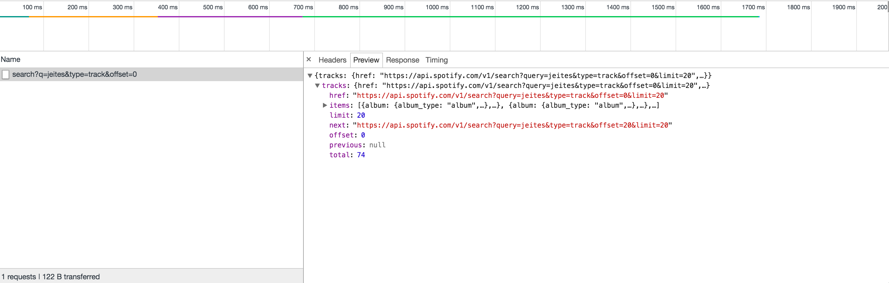

# Paginación

En este material vamos a aprender como podemos mejorar un poco la eficacia de nuestra aplicación agregando paginación. Si observamos la respuesta de la API, cada vez que realizamos una búsqueda obtenemos una serie de resultados acotados (siempre el máximo es 20, aunque se puede configurar). Pero también obtenemos cierta información relevante que nos permite obtener resultados paginados, es decir obtener todos las canciones posibles para una misma búsqueda a través de varias peticiones (con diferentes parámetros).

Esto obviamente siempre es recomendado hacer por cuestiones de *performance*, ya que si una búsqueda nos arroja 3000 resultados el rendimiento de nuestra aplicación no seria optimo: primero porque la cantidad de información (que viaja en la respuesta) aumenta considerablemente y segundo porque le renderización simultánea en el browser de 3000 canciones podría ser un posible cuello de botella. Es por eso que en general siempre que trabajen con API's REST deben considerar paginar los resultados.

Lo primero que vamos a ver es cual es la información util que tenemos en la respuesta de la API para aplicar la funcionalidad correspondiente (recuerden que podemos chequear nuestra petición usando las *dev tools* del browser):



Como vemos en la imagen, tenemos varias propiedades interesantes. Vamos a repasarlas:

1. `limit` ➡️ Nos indica cuantos elementos por página estamos trayendo, como no establecemos un valor especifico, la API lo hace en 20 por defecto.
2. `next` ➡️ Viene con una url que podríamos usar para hacer la próxima petición, nosotros no vamos a usar esa url, pero si vamos a tener en cuenta que cuando el valor de `next` sea `null` es porque no tenemos mas paginas para pedir a la API.
3. `total` ➡️ Esto es obviamente la cantidad total de resultados que se encontraron (teniendo en cuenta todas las paginas).
4. `offset` ➡️ Este es el valor que nos permite ir cambiando de página (en conjunto con `limit`), indicando cuantos elementos iremos ignorando.

## Razonamiento

Pensemos entonces como podríamos hacer la paginación de lo resultados. El valor inicial de `offset` es `0`, para entender el funcionamiento de esta propiedad podemos imaginar que todos los resultados encontrados de la búsqueda están almacenados en un `array` (esto es ficticio, solo para entender como funciona la paginación).

Habiendo dicho eso cuando el valor `offset` es `0` estamos indicando que queremos obtener las canciones dentro del `array` (ficticio) a partir del indice `0` (del `array`) hasta la posición `20` (que es el valor de `limit`). Una vez que obtenemos la primer página simplemente tenemos que incrementar el valor de `offset` en `20`, ya que es el valor de la propiedad `limit`, para poder pedir a la API la segunda página. Lo que debemos hacer luego es repetir este procedimiento hasta que no haya mas resultados o paginas para obtener. Como mencionamos antes, eso podemos hacerlo si checamos que la propiedad `next` de la respuesta sea igual a `null`.

> Este tipo de patron de paginación es un estándar bastante común que podemos encontrarlo en diferentes tipos de API's, aunque pueden variar los nombres o la cantidad de las propiedades en la respuesta. De todos modos las propiedades mas importantes siempre son `limit` y `offset`, las otras no son indispensables.

## Implementación

Ya entendemos como funciona la paginación, vamos a aplicar el razonamiento a nuestro código.

1. Lo primero que hacemos es modificar el archivo `src/services/track.js` para agregar el argumento `offset` en el método `search`:

```javascript
trackService.search = function (q, offset = 0) {
  const type = 'track'

  return platziMusicService.get('/search', {
    params: { q, type, offset }
  })
    .then(res => res.data)
}
```

2. Luego vamos al archivo `src/components/Search.vue`. Aquí es donde vamos a realizar la mayoría de las modificaciones.

    1. Creamos dentro de la función `data` un objeto `pagination` con todas las propiedades necesarias para paginar los resultados.

    ```javascript
    //... ➡️ mas código del componente

    data () {
      return {
        searchQuery: '',
        tracks: [],

        isLoading: false,
        showNotification: false,

        selectedTrack: '',

        pagination: {
          offset: 0,
          limit: 20,
          hasEnd: false,
          isLoading: false
        }
      }
    },

    //... ➡️ mas código del componente
    ```

    2. Ahora vamos a modificar el método `search` del componente para que luego de la primer petición se incremente nuestro `offset` en base a `limit`, es decir que pase de `0` a `20`.

    ```javascript

    //... ➡️ mas código del componente

    methods: {
      search (shouldConcat = false) {
        if (!this.searchQuery) { return }

        this.isLoading = true

        trackService.search(this.searchQuery)
          .then(res => {
            this.pagination.offset += this.pagination.limit // ⚠️ Incrementamos el valor de offset en base a limit
            this.pagination.total += res.tracks.total // ⚠️ Nos guardamos la verdadera cantidad de resultados encontrados

            this.showNotification = res.tracks.total === 0
            this.tracks = res.tracks.items
            this.isLoading = false
          })
      },

      //... ➡️ mas código de methods

    }

    //... ➡️ mas código del componente
    ```

    3. Luego agregamos un nuevo método dentro del objeto `methods` llamado `loadNextPage`. Este método lo vamos a utilizar para traer la siguiente página. El flujo seria usar `search` para realizar la búsqueda y cargar la primera página y luego usar `loadNextPage` para cargar el resto de los resultados.

    ```javascript

    //... ➡️ mas código del componente

    methods: {
      //... ➡️ mas código de methods

      loadNextPage () {
        if (!this.searchQuery) { return }

        this.pagination.isLoading = true

        trackService.search(this.searchQuery, this.pagination.offset)
          .then(res => {
            this.pagination.offset += this.pagination.limit // ⚠️ Incrementamos el valor de offset en base a
            this.pagination.hasEnd = res.tracks.next === null // ⚠️ Checamos si hay mas resultados para obtener

            this.tracks = [...this.tracks, ...res.tracks.items] // ⚠️ Usamos el spread operator para concatenar arrays: lo que ya tenemos en tracks de paginas anteriores + lo nuevo de la siguiente página

            this.pagination.isLoading = false // ⚠️ Usamos otra propiedad isLoading para mostrar otro tipo de loader y mejorar la UX
          })
      },

      //... ➡️ mas código de methods

    }

    //... ➡️ mas código del componente
    ```

3. En este paso vamos a incorporar el HTML necesario dentro del componente, recuerden que seguimos trabajando en de `src/components/Search.vue`. Localizamos el `div` con la clase `results` y agregamos lo siguiente:

```pug
//-... ➡️ mas markup del componente

.container.results

  //- ⚠️ Este contenido es igual al que teníamos.
  .columns.is-multiline
    .column.is-one-quarter(v-for="t in tracks")
      pm-track(
        v-blur="t.preview_url",
        :class="{ 'is-active': t.id === selectedTrack }",
        :track="t",
        @select="setSelectedTrack"
      )

  //- ⚠️ Este es el contenido que tenemos que incorporar
  .columns(v-show="tracks.length && !pagination.hasEnd")
    .column.has-text-centered
      button.button(
        @click="loadNextPage()",
        :class="{ 'is-loading': pagination.isLoading }",
        :disabled="pagination.isLoading"
      ) Cargar Mas
```

> Lo que hacemos en sencillo, agregamos un botón que esta enlazado al método `loadNextPage` con un `@click`. Dentro del botón usamos un *binding* al atributo `class` para agregar un estilo de *loading* cuando esta cargando (y también para desabilitar el botón). Por ultimo usamos un `v-show` para mostrar el botón solo cuando se haya realizado la búsqueda y no se haya alcanzado el limite de los resultados.

4. El último paso (también dentro de `src/components/Search.vue`), es agregar una *watcher* sobre la propiedad `searchQuery` para que cada vez que su valor mute se reinicien los valores del objeto `pagination`. De esta manera no vamos a comprometer los resultados de una búsqueda con los de la anterior. También vamos a modificar el valor de la propiedad computada `searchMessage` para utilizar la cantidad real de resultados encontrados.

```javascript

//-... ➡️ mas código del componente

computed: {
  searchMessage () {
    return `Encontrados: ${this.pagination.total}`
  }
},

watch: {
  //-... ➡️ mas markup del objeto watch

  searchQuery () {
    this.pagination.offset = 0
    this.pagination.hasEnd = false
    this.pagination.isLoading = false
  }
},

//-... ➡️ mas código del componente
```

---
Listo, ahora si que nuestra aplicación esta totalmente terminada y nos permite obtener todos los resultados posibles sobre una búsqueda. Ante cualquier consulta, recuerda que podes checar el código funcionando en este [link](https://github.com/platzi/platzi-music-vue/tree/pagination). Espero que puedas implementarlo y no dudes subir tus aporte en la plataforma.


